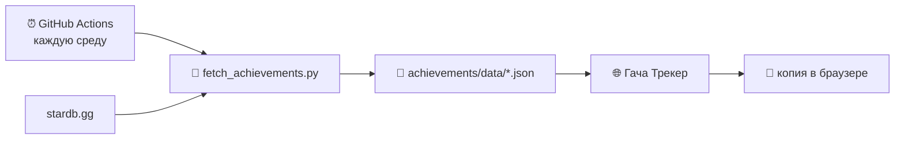

<div align="center">


# Гача Трекер

**Трекер наград, круток и достижений для Genshin Impact, Honkai: Star Rail и Zenless Zone Zero**

Работает прямо в браузере · без регистрации · ваши данные никуда не отправляются

### [Открыть трекер →](https://USERNAME.github.io/REPO/)


</div>

---

## Зачем это

Если вы играете в гачи от HoYoverse, то наверняка хоть раз задавались вопросами: сколько примогемов ещё можно выбить из достижений? Сколько круток в среднем уходит на пятизвёздочного? Как часто я выигрываю 50/50? Хватит ли нефрита к следующему баннеру?

Гача Трекер собирает ответы в одном месте. Это обычная веб-страница: открыли — пользуетесь. Ничего не нужно устанавливать, не нужен аккаунт, и никто, кроме вас, не видит ваших данных.

| | Раздел | Что умеет |
|:--:|:--|:--|
| 🏆 | **Достижения** | Все достижения трёх игр, включая скрытые, с наградами, фильтрами и отметкой прогресса |
| 🎲 | **История** | Загружает историю круток и считает гаранты, средние значения и статистику 50/50 |
| 💎 | **Крутки** | Учёт запасов валюты и билетов по патчам |
| 📅 | **Календарь** | Ежедневные награды Zenless Zone Zero с итогами за месяц и год |

---

## 🏆 Достижения

Полный список достижений — обычных и скрытых — с наградами, версиями появления и подсказками, как их получить.

| | Genshin Impact | Honkai: Star Rail | Zenless Zone Zero |
|:--|--:|--:|--:|
| Достижений | 1 854 | 1 950 | 969 |
| Категорий | 73 | 9 | 25 |
| Всего можно получить | 14 085 примогемов | 11 155 нефрита | 7 185 полихромов |

<sub>На 8 октября 2026 года. Базы обновляются автоматически раз в неделю.</sub>

- **Найти нужное:** фильтры по категории, версии игры (`4.x` целиком или конкретный патч), награде, сложности, скрытым и обычным, плюс поиск по тексту.
- **Не упустить важное:** отдельно помечены достижения, которые можно пропустить навсегда, требуют персонажа из баннера, растянуты на недели или взаимоисключают друг друга.
- **Видеть, сколько осталось:** сайт считает, сколько валюты вы уже получили и сколько ещё можно забрать — в целом и в любой выборке.
- **Без спойлеров:** описания скрытых достижений можно размыть, пока вы их не получили.
- **Перенести прогресс:** импорт и экспорт в формате **UIAF**, который понимают другие трекеры Genshin.

---

## 🎲 История круток

Загрузите файл истории в формате **UIGF v4** — его умеют делать популярные выгрузчики, например [stardb.gg](https://stardb.gg).

- Перед загрузкой видно, что именно добавится, — ничего не перезапишется без вашего ведома.
- Можно загружать файлы из разных источников: они дополнят друг друга без дублей.
- Для каждого баннера: текущий гарант, сколько круток ушло на каждое ценное выпадение, среднее значение.
- **Статистика 50/50:** выигрыши, проигрыши и гаранты; разметку можно поправить вручную.
- Портреты выпавших персонажей и оружия, таблицей или сеткой.
- В Chrome и Edge страница может запомнить файл выгрузки и сама перечитывать его при каждом открытии.

---

## 💎 Крутки и 📅 Календарь

**Крутки** — простой учёт валюты по играм и патчам: сколько было в начале патча, сколько стало к концу и во сколько круток это выливается. Подходит для любой игры, не только для трёх перечисленных.

**Календарь** — для ежедневных наград в Zenless Zone Zero. Отмечайте, что выпало за день, и смотрите итоги за месяц и год, графики и самые удачные дни. День переключается по времени выбранного сервера, а не в полночь.

---

## 🔒 Где хранятся данные

**Только в вашем браузере.** У трекера нет сервера: всё, что вы отмечаете и загружаете, остаётся на вашем устройстве. Файлы истории круток читаются локально и никуда не отправляются.

Чтобы перенести данные на другое устройство или подстраховаться, откройте меню **···** и выберите **«Скачать резервную копию»**. Один файл сохранит всё: календарь, крутки, историю и прогресс достижений.

> [!WARNING]
> Если очистить данные браузера, записи пропадут. Время от времени сохраняйте резервную копию.

---

## ❓ Частые вопросы

<details>
<summary><b>Нужно ли вводить логин или пароль от игры?</b></summary>
<br>
Нет. Трекер не подключается к аккаунту и не просит никаких данных для входа. Историю круток вы загружаете сами — файлом, сделанным сторонним выгрузчиком.
</details>

<details>
<summary><b>Откуда берётся список достижений?</b></summary>
<br>
Из открытой базы <a href="https://stardb.gg">stardb.gg</a>. Раз в неделю её автоматически скачивает скрипт в GitHub Actions, поэтому достижения из новых патчей появляются без участия человека.
</details>

<details>
<summary><b>Почему подсказки к достижениям на английском?</b></summary>
<br>
Так их публикует stardb.gg: названия и описания там переведены, а подсказки сообщества — нет.
</details>

<details>
<summary><b>Работает ли на телефоне?</b></summary>
<br>
Да, страница адаптирована под мобильные экраны. Разделы открываются через меню ≡ в левом верхнем углу.
</details>

<details>
<summary><b>Это официальный проект HoYoverse?</b></summary>
<br>
Нет, это неофициальный фанатский проект.
</details>

---

## 🛠 Свой экземпляр

Хотите собственную копию — например, чтобы что-то в ней поменять?

1. Нажмите **Fork** вверху страницы репозитория.
2. В своей копии: **Settings → Pages**, источник — ветка `main`, папка `/ (root)`.
3. **Actions** → включите workflows и один раз запустите **«Обновление базы достижений»** кнопкой **Run workflow**.

Через минуту сайт будет доступен по адресу `https://<ваш-ник>.github.io/<имя-репозитория>/`, а базы достижений начнут обновляться каждую среду.

<details>
<summary><b>Как устроен проект</b></summary>
<br>

Весь трекер — один файл `index.html` на чистом HTML, CSS и JavaScript, без фреймворков и сборки. Данные хранятся в `localStorage` и `IndexedDB`.

Базы достижений собирает Python-скрипт (только стандартная библиотека, Python 3.8+). Сайт читает их напрямую из репозитория, поэтому новые данные видны сразу после коммита.



```
├── index.html                          # весь трекер
├── favicon.svg
├── achievements/
│   ├── fetch_achievements.py           # сборщик баз достижений
│   └── data/                           # базы по играм
└── .github/workflows/
    └── update-achievements.yml         # еженедельное обновление
```

Запустить сборщик вручную:

```bash
python achievements/fetch_achievements.py --out achievements/data --lang ru
```

Параметры: `--games gi,hsr,zzz` — какие игры, `--lang` — язык (`ru`, `en`, `ja`…), `--source auto|stardb|fallback` — откуда брать данные.

Если открыть `index.html` прямо с диска, всё, кроме достижений, работает сразу. Для достижений запустите локальный сервер (`python -m http.server`) или загрузите файл базы кнопкой **«Загрузить файл»**.

</details>

---

<div align="center">
<sub>Достижения — <a href="https://stardb.gg">stardb.gg</a> · Портреты — Enka.Network, Project Amber, Yatta, Hakush, Nanoka<br>
Неофициальный фанатский проект. Genshin Impact, Honkai: Star Rail и Zenless Zone Zero — товарные знаки HoYoverse.</sub>
</div>
